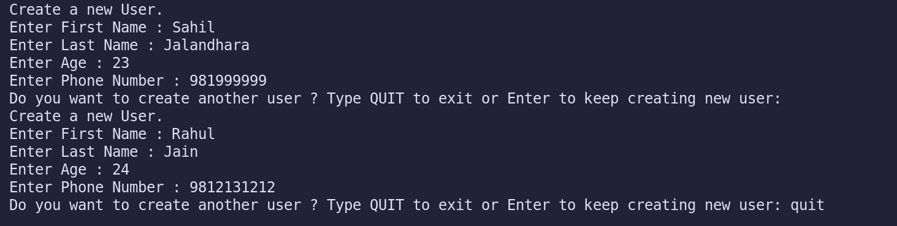

# Question 1 Write a program to display values of enums using a constructor & getPrice() method (Example display house & their prices)

# Answer 1

```java
public class EnumDisplay {

    public static void main(String[] args) {
       for (Houses h : Houses.values()) {
           System.out.println("Price of " + h.name()+" house is "+h.getPrice());
       } 
    }

}

enum Houses {
    SMALL(500000), MEDIUM(800000), LARGE(900000), MANSION(10000000);

    private int price;

    Houses(int price) {
        this.price = price;
    }

    public int getPrice() {
        return price;
    }
    
}
```

# Question 2 Create a User class with fields: firstname, lastname, age, phonenumber. Write a program which accepts values of user fields from commandline, create object and append that to a text file. After every user creation the program should prompt: "Do you want to continue creating users? (Type QUIT to exit)" and keep on accepting values and writing to file unitl user quits.

# Answer 2

### Java Code

```java

```

###  Images
 
 


